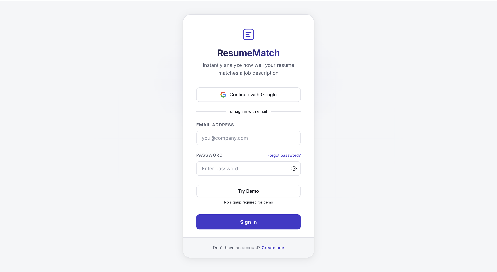
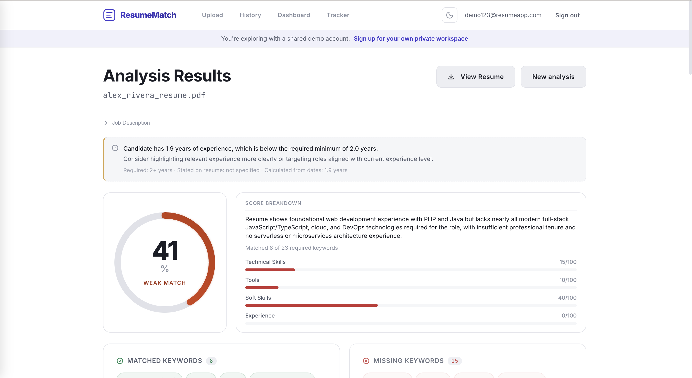
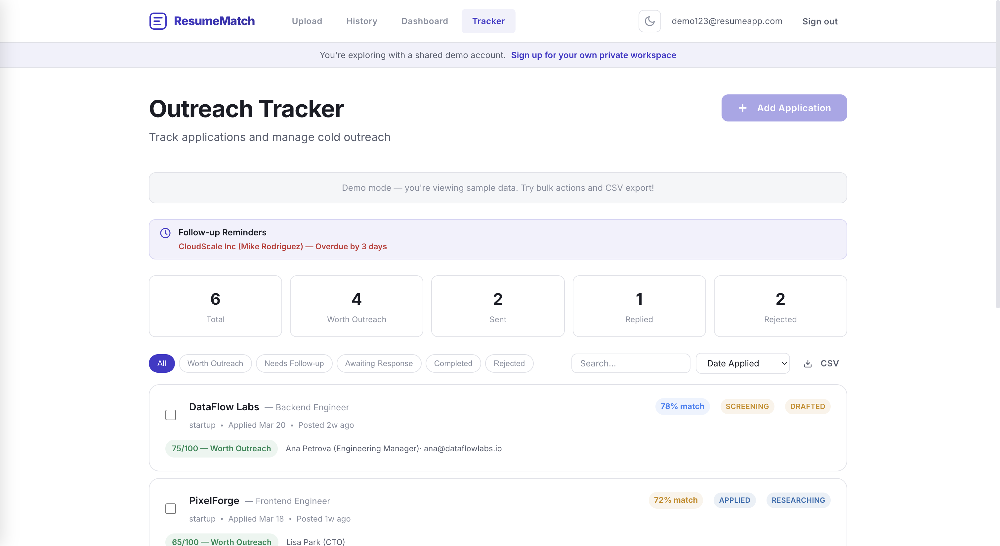

# ResumeMatch

ResumeMatch is a production-grade, fully serverless AI resume analyzer deployed on AWS that helps job seekers evaluate how well their resume matches a job description and identify gaps before applying.

## Screenshots

### Login



### Resume Analysis



### Outreach Tracker



## Live Demo

Try the app here:

https://resumematchapp.com

Demo account is available via the **Try Demo** button on the login page.

## System Design Highlights

- Fully serverless architecture with automatic scaling
- Multi-pass AI analysis pipeline using Amazon Bedrock
- Cost tracking dashboard for AI inference monitoring
- Resume history stored in DynamoDB for fast retrieval
- Secure authentication and password recovery with AWS Cognito

## How It Works

```
Upload Resume (PDF) + Paste JD → Textract OCR → Bedrock 4-Pass Analysis → DynamoDB → Results UI
```

1. **Upload** — User uploads a resume PDF and pastes the target job description
2. **Extract** — Amazon Textract pulls structured text from the PDF
3. **Analyze** — Amazon Bedrock (Claude Haiku) runs four passes: keyword extraction, match scoring, experience gap analysis, and resume rewriting
4. **Store** — Results persist in DynamoDB for fast retrieval and history
5. **Display** — Frontend renders match score with breakdown, keyword gaps with priority ranking, experience warnings, actionable suggestions, and a side-by-side diff of the rewritten resume

## Features

### AI Resume Analysis
- **Match scoring with breakdown** — overall score with category scores (Technical Skills, Tools, Soft Skills, Experience)
- **Keyword gap analysis** — highlights missing keywords from the job description
- **Experience mismatch detection** — compares resume experience against job requirements
- **AI resume rewriting** — suggests improved resume phrasing based on the JD

### Application Tracking
- **Kanban board view** — drag-and-drop cards across application stages (Not Applied → Applied → Screening → Interviewing → Offer / Rejected)
- **Outreach tracker** — manage job applications with outreach and application pipelines
- **Outreach scoring** — 0–100 score indicating whether outreach is worth pursuing
- **Follow-up reminders** — notifications for overdue or upcoming follow-ups
- **Contact management** — store recruiter or hiring manager information

### Platform Features
- **Analysis history** — view past resume analyses and results
- **Secure authentication** — Cognito login, signup, verification, and password reset
- **Demo mode** — explore the app instantly without creating an account
- **Cost dashboard (demo workspace)** — visualize estimated AI inference cost per analysis

## Authentication Flow

ResumeMatch uses AWS Cognito for user authentication.

Supported flows:

1. **Login** — email + password authentication
2. **Signup** — create account with email and password
3. **Email verification** — Cognito sends a confirmation code
4. **Password reset** — request reset code via email
5. **Verification code** — enter 6-digit code to set a new password
6. **Demo mode** — instant access using a demo account (no signup required)

Verification and password reset emails are automatically delivered by AWS Cognito.

## Scoring Rubric

The AI uses the full 0–100 range. Hover over the score ring on the results page to see the interpretation.

| Score | Label | Color | Action |
|-------|-------|-------|--------|
| 86–100 | Strong Match | Green | Apply with confidence. Highlight your matched keywords in a cover letter. |
| 76–85 | Good Match | Blue | Apply and address missing keywords in your cover letter. |
| 61–75 | Moderate Match | Amber | Update your resume to include missing keywords before applying. |
| 41–60 | Weak Match | Orange | Significant gaps exist. Address them in a strong cover letter. |
| 0–40 | Poor Match | Red | This role may not be the right fit. Try better-matched opportunities. |

The score ring, label text, and history mini-rings all use the same 5-tier color system. The label is displayed inside the progress ring; the action text appears as a tooltip on hover.

## Outreach Scoring

Each application gets a 0–100 outreach score. Applications scoring 60+ are labeled **Worth Outreach**; below 60 is **Low Priority**.

The score is the sum of five weighted factors:

| Factor | Condition | Points |
|--------|-----------|--------|
| **Skill Match** (max 35) | 80%+ match | +35 |
| | 60–79% match | +25 |
| | 40–59% match | +10 |
| | < 40% match | +0 |
| **Company Size** (max 25) | Startup | +25 |
| | Mid-size | +10 |
| | Enterprise | +0 |
| **Contact Email** (max 20) | Has email | +20 |
| | No email | +0 |
| **Posting Age** (max 15) | < 1 week | +15 |
| | 1–2 weeks | +10 |
| | Unknown | +5 |
| | 2+ weeks | +0 |
| **Seniority Fit** (max 5) | Entry/Junior | +5 |
| | Mid or Unknown | +3 |
| | Senior | +0 |

The score breakdown is visible in each application's detail view.

## Architecture

Built and deployed as a fully serverless stack:

- **Compute:** AWS Lambda
- **Storage:** S3, DynamoDB
- **AI/ML:** Amazon Textract (OCR), Amazon Bedrock (Claude Haiku)
- **API:** API Gateway
- **Auth:** AWS Cognito (email/password authentication, signup verification, password reset flow, session management)
- **CDN:** CloudFront
- **Frontend:** React 18, TypeScript, Vite

## Tech Stack

Frontend:
- React 18
- TypeScript
- Vite

Backend:
- AWS Lambda
- API Gateway

AI:
- Amazon Bedrock (Claude Haiku)

Infrastructure:
- S3
- DynamoDB
- CloudFront
- Cognito

## Getting Started

### Prerequisites

- Node.js 18+
- npm

### Install & Run

```bash
npm install
npm run dev
```

The app runs at `http://localhost:5173` by default.

### Build for Production

```bash
npm run build
npm run preview
```


### Demo Access

You can explore the app without creating an account.

Click **Try Demo** on the login page to automatically access a demo workspace.

Demo credentials (for manual login):

```
Email:    demo123@resumeapp.com
Password: ResumeApp123!?
```

## Project Structure

```
src/
  api/          # API client and endpoint functions
  auth/         # Authentication context and route guards
  components/   # Reusable UI components
  config/       # AWS Amplify configuration
  hooks/        # Custom React hooks
  pages/        # Page components (Login, Signup, ForgotPassword, ResetPassword, Upload, Results, History)
  types/        # TypeScript type definitions
```
